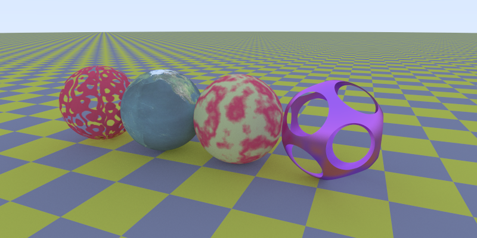
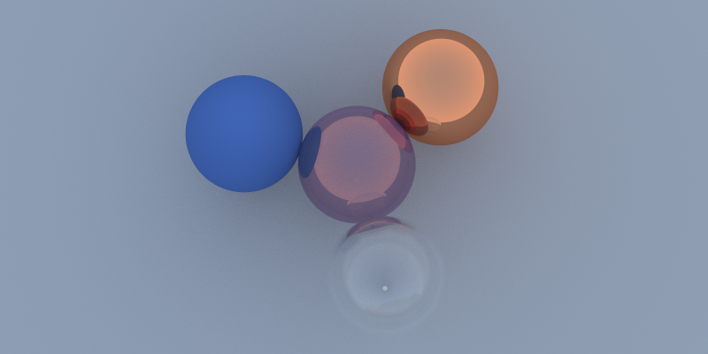
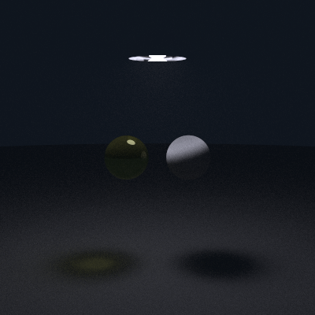
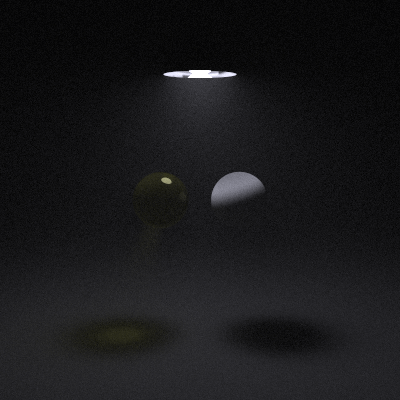
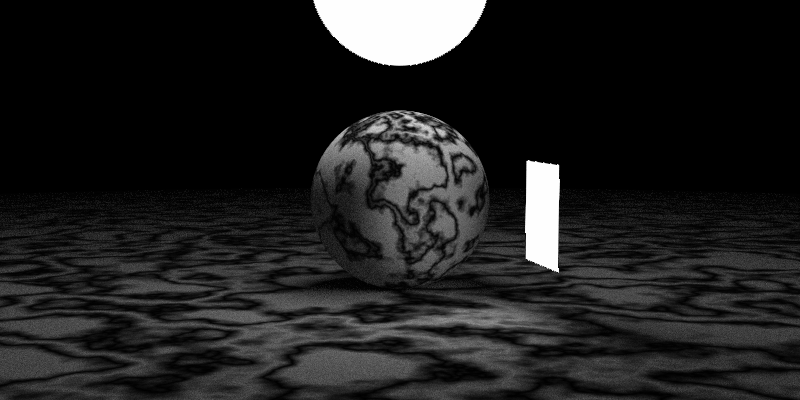
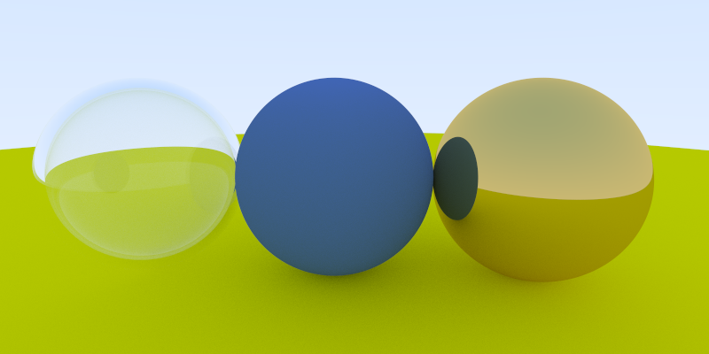

# ray-tracing-cpp

“Note that I avoid most “modern features” of C++, but inheritance and operator overloading are too useful for ray tracers to pass on.”  
― [Peter Shirley](https://research.nvidia.com/person/peter-shirley), [Ray Tracing in One Weekend](https://www.goodreads.com/book/show/28794030-ray-tracing-in-one-weekend)

---

Ray tracing with C++

